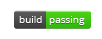

<body style="background-color: white;">

# **Work Day Planner** 

## Check out the deployed app <a href="https://desmondaldridge.github.io/work-day-scheduler/">here!</a>

 

## <u>FEATURES</u>

##### **BUILT WITH:**
<ul>
<li><a href="momentjs.com">MOMENT.JS</a>``</li>
<li><a href="getbootstrap.com">BOOTSTRAP</a>``</li>
</ul>

#### This daily planner is designed for a standard work day, and allows you to write and save entries for any or all of the 8 time slots available (9am - 5pm).

#### The current hour is always highlighted and distinct from both upcoming and previous entries.

 

#### Happy scheduling!

 
 
  

## <u>REFLECTIONS</u>

#### My commit comments detail my process, mostly a series of troubleshooting, learning, and relearning from all aspects of coding from logic, available methods, general syntax, scope, etc. 

#### In this assignment in particular a lot of solutions at first <marquee height="17" width="30">alluded</marquee> me, but obvously that in itself provides A LOT of learning opportunities (both in discovering new aspects and tools to approach and tackle common issues at hand as well as simply reinforcing what was learned in class). I thoroughly enjoy this assignment.